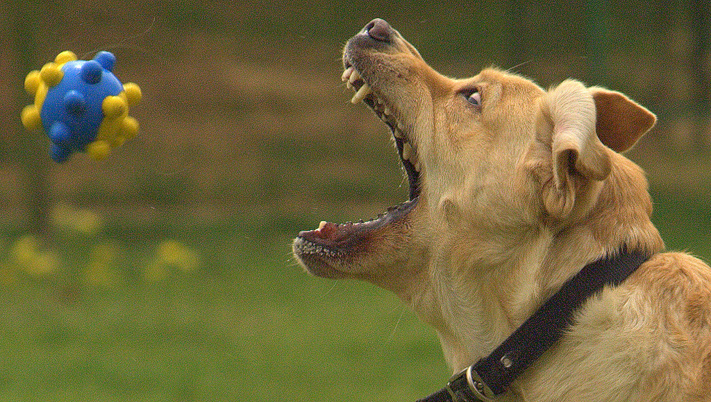
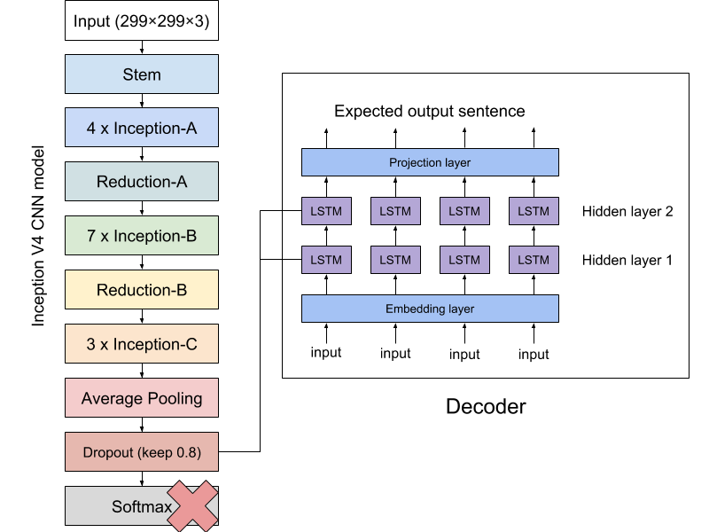

# Project Proposal

Click [here](../proposal/) to view our project proposal.

# What We Did

Our original goal was first to build and train a model that could detect details, or what we call tags, from the images, and then create another model that could take the tags and return captions of the pictures. 

We read some papers related to Image Captioning and Long Short-Term Memory. We also analyzed some models designed by others, such as `TensorFlow Slim Image Classification Model` and `Show and Tell: A Neural Image Caption Generator`. However, we find there are some problems with the models that could convert images to tags. 

One problem was the unrelated tags. When we tried to use a pre-trained model called `Inception V4` to convert the images, the model returned some tags that were not related to the captions. For example, for the following picture, the model returned `Labrador retriever`, `golden retriever`, `Chesapeake Bay retriever`, `Rhodesian ridgeback`, `American Staffordshire terrier`, `Staffordshire terrier`, `American pit bull terrier` etc. It seems that the model was more interested in detecting the dog breeds instead of what the dog was doing.

Another problem was the training time and resources. When we followed an instruction from `TensorFlow Slim Image Classification Model`, we had to download a 13 GB original datasets and spent another 70 GB to store the formatted datasets. When the training begins, it was so slow that we supposed to wait for a week before got the result. Since we were training the model on a paid GPU machine, we could not offer such long training time.

As a result, we decided to use the pre-trained model and begin to build the second model. 

In the meantime, we had generated images to tags for `Flickr8K`. You can click [here](../assets/img2tag.zip) to download the dataset that we produced. 

# What We Will Do

Our model is going to use a combination of CNN and RNN. The CNN can process the images and RNN will handle the outputs of CNN and outputs sentences we expected.

We are currently working on the LSTM RNN network to process the output from the CNN nets. For CNN, we cannot directly use its outputs. (Otherwise, it will generate unrelated tags.) Instead, we would like to delete the final softmax layer of CNN and apply a fully connected layer to connect CNN and RNN. In this case, we can train the RNN based on the CNN we use but not the actual output tags that the CNN produces. This can be used to reduce the error of two combined networks since the first model is trained separately.

For RNN, we are going to build a sequence to sequence network based on LSTM structure. However, we only need to use the decoder of this network. The inputs of the decoder will be the outputs of CNN so that the fully connected layer is connected to LSTM cells in the hidden layers of the decoder.

Since there are many papers and projects based on images to text networks, we are expecting to use a better CNN model to get a better result. Moreover, we are focusing more on processing various categories of images not only the performance.

# Final Report

Click [here](../final/) to view our final report.