## Project Proposal

Click [here](../proposal/) to view our project proposal.

## Progress Report

Click [here](../report/) to view our progress report.

## Code

Click [here](https://github.com/sharedcare/ImageCaptioning/) to view our code.

## Analysis Yizhen

We analyzed the paper ["Deep Visual-Semantic Alignments for Generating Image Descriptions"](https://cs.stanford.edu/people/karpathy/cvpr2015.pdf) by Andrej Karpathya and Li Fei-Fei and the paper ["Show and Tell: Lessons learned from the 2015 MSCOCO Image Captioning Challenge"](https://arxiv.org/pdf/1609.06647.pdf) by Vinyals et al. from Google.

In *Deep Visual-Semantic Alignments for Generating Image Descriptions*, they use [VGG16](http://www.robots.ox.ac.uk/~vgg/research/very_deep/) as their CNN. Their image captioning model is VGG16 combined with 2 layers of LSTM RNN. In their code, the base implementation is using [Torch](http://torch.ch/) as their deep learning framework. They use Flickr8K / Flickr30K / COCO as their datasets. The basic model structure looks like [this](../assets/model_1.png). The last fully-connect softmax layer is removed, instead they use a dense layer mapping CNN output to the RNN input. An improvement can be made on their model by adding CNN output as initial state to every RNN hidden layer -- [An alternative model](../model_2.png). Their code is available [here](https://github.com/karpathy/neuraltalk).

In *Show and Tell: Lessons learned from the 2015 MSCOCO Image Captioning Challenge*, the researchers in Google find a alternative way to achieve the same purpose. They use the similar structure like Andrej Karpathya and Li Fei-Fei did. However, they use [TensorFlow](https://www.tensorflow.org/) as deep learning framework. For their input, they use MSCOCO as their dataset. As for the image captioning model, they use [Inception V3](https://arxiv.org/pdf/1512.00567.pdf) as their CNN model and 3 layers of LSTM as RNN. The basic model looks like [this](../assets/model_3.png). They use a concatenate layer to combine image features and input sequence. Their code is provided on [Github](https://github.com/tensorflow/models/tree/master/research/im2txt).

## Process
### Introduction Yizhen
Based on their papers and codes. We concludes that the basic model can be redesigned to achieve the maximum performance. However, we use a similar structure as they did (CNN combined with RNN). For our CNN model,  we use Inception V3, [Inception V4]() and VGG16 to train own image captioning model. In our RNN part, we use 3 layers of LSTM and use a add layer to combine the image features and sequence input. The basic idea is: 

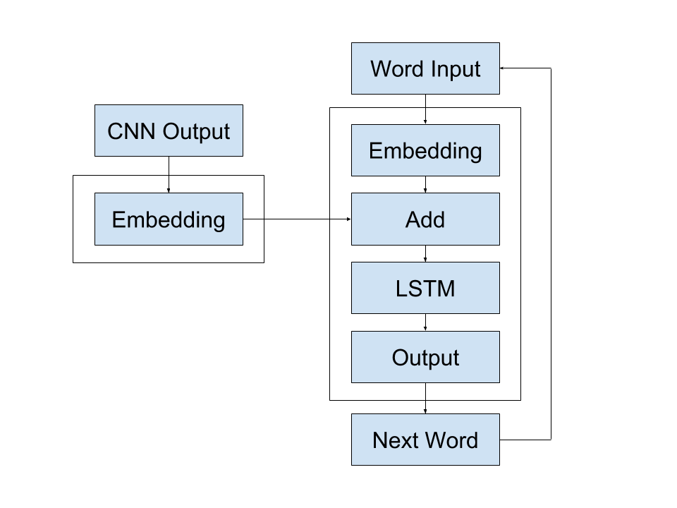

As for our training, we could not have enough time to train both CNN and RNN, instead, we used pre-trained CNN models and fine-tune them to fit our purpose. And we use Flickr8k as our dataset. We also use a different shape of sequence input which is different from the models mentioned above. Our model use 3 dimensional sequence input with (batch size, sequence length, vocabulary size) but they use 2 dimensional sequence input with (batch size, sequence length).
### Implementation

We use [Keras](https://keras.io/) as our deep learning framework. Since it is easy to use and present.

For this project, we use 2 different CNN structures to train our model.

[Inception V3 + LSTM](../assets/model_inception_v3.png) and [Inception V4 + LSTM](../assets/model_inception_v4.png).

#### callback.py Tiancheng

`Callback` are classes that `fit` or `fit_generator` functions of the model will call at specified points during the training, such as after each batch or after each epoch.

`FloydMetrics` is a `Callback` class that will print metrics information after every 20 batches so that the platform that we use, [Floyd](https://www.floydhub.com/), can collect the metrics and draw graphs for us. `ModelCheckpoint` will save checkpoint. `TensorBoard` will save logs for `TensorBoard` to check. `ReduceLROnPlateau` will reduce the learning rate if the loss decreases slow.

#### generator.py Tiancheng

There are two things happen in this file.

The `generator` function reads the data of captions and get a list of all the images. After that, it call `Caption Preprocessor` and feed all the captions so that the `Caption Preprocessor` can build dictionary like structure to store all the words and their index. Then, it call `Image Preprocessor` to convert all the images to a `np.array` with the shape (8000, 299, 299, 3). 8000 is the number of images. 299 is the size of each image. And 3 means three colors (RGB). In the end, it return an `Image Sequence` instance.

The `ImgSequence` (`Image Sequence`) class gets all the data of images, and captions and provides an iterable function `__getitem__`. Every time when the `fit_generator` calls `__getitem__`, it will choose `n` (`n = batch_size`) images randomly and then choose one of their captions randomly (each image has at least five captions). After that, it will encode the captions to a `np.array` with the shape (35, 31, 8389). 35 is the batch size. 31 is the sentence length. And 8389 is the length of the words dictionary. The inputs and outputs have one word difference. So if the input is `<sos> A dog with a red Frisbee flying in the air`, the output should be `A dog with a red Frisbee flying in the air <eos>`. In the end, the function wrap all the batch data together and return them to the `fit_generator`.

#### preprocessing/caption_processing.py Tiancheng

`Caption Preprocessor` provides functions to convert all the image captions to dictionary like structure. We use a text tokenization utility class called `Tokenizer` from `Keras` to handle most of the tasks. First,  it reads all the captions provided by `generator` and warps them with the starting tag `<sos>` and ending tag `<eos>`. After that, it fits the captions to the `Tokenizer` and get the dictionary results. It also provides functions for `ImgSequence` to encode the captions.

#### preprocessing/image_processing.py Yizhen

`Image Preprocessor` provides functions to convert image files to image arrays. The image array batch is a numpy array with shape (batch size, width, height, dimension). The image array contains float numbers represent every pixel in images.

#### models.py Yizhen

The image captioning model is designed and built in this file. We wrap the whole structure of the model and provides 3 different CNN models (Inception V3, Inception V4, VGG16) in this image captioning model.

#### train.py Yizhen

Train contains both training and prediction methods. Training configuration can be changed by modifying the `CONFIG`.

### Training

#### Inception V3 + NVIDIA Tesla K80 Tiancheng Luo

We use Inception V3 as the pretrained image recognition model in this training. We use a machine from [Floyd](https://www.floydhub.com/) with NVIDIA Tesla K80 to do the training. It takes about 18 hours to finish 55 epochs. 

The training accuracy you see here starts at the sixth epoch. We trained the first five epochs to verify our model and then continued to the sixth training.

#### Inception V4 + NVIDIA GeForce GTX 960M Yizhen

We also use Inception V4 as the pre-trained image recognition model. We use a local machine with a NVIDIA GeForce GTX 960M graphic card to train this model. It takes about 30 minutes to finish an epoch. We planed to train 50 epochs for this model. However, the program crashed during the training process due to lacking of memory. Hence, the training process ended at 28 epochs. But we still get some reasonable result.

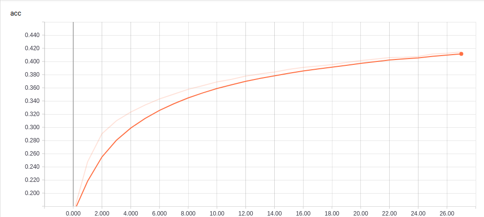

The largest training accuracy is 0.414.

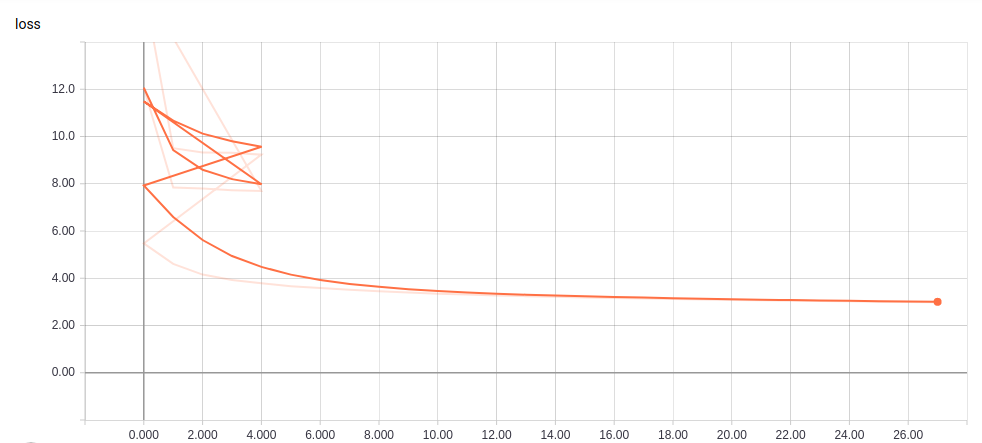

The minimum training loss is 3.002.

## Results Tiancheng

We download some images from the internet randomly and let the model predicts the captions. Here are what we get.

### Inception V3 + NVIDIA Tesla K80

#### Describes without Errors

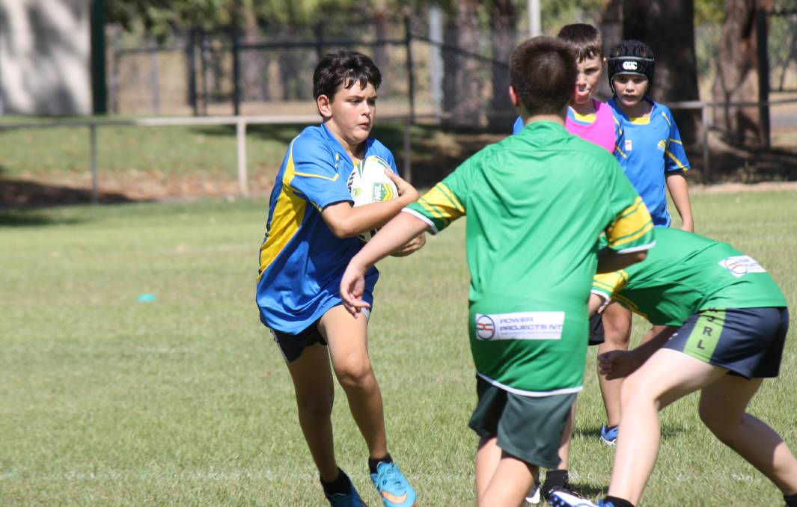
A group of men play soccer.

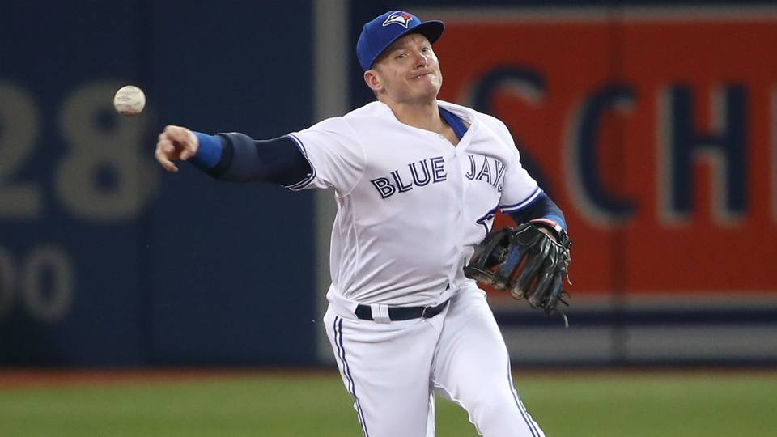
A baseball player in a white uniform is running on the court.

A group of children playing soccer.

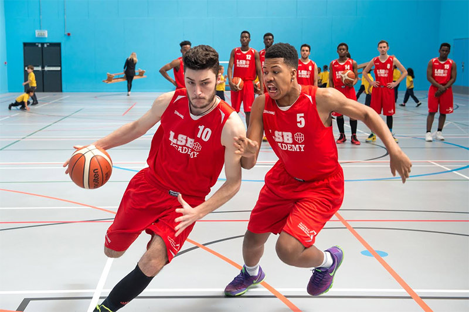
A group of men playing basketball.

#### Describes with Minor Errors

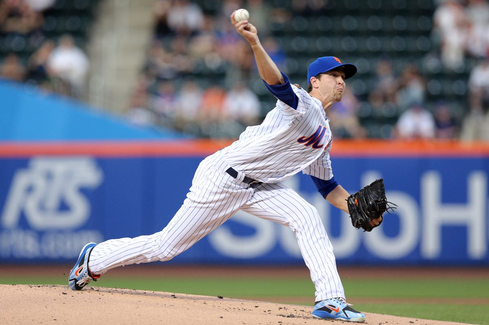
A man in a blue shirt is jumping in the air with a racquet.

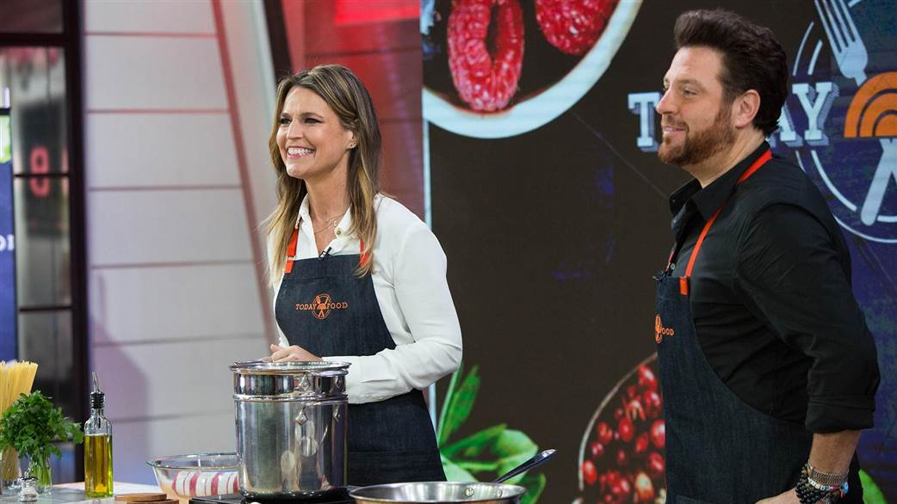
A man and a woman are standing in front of a restaurant.

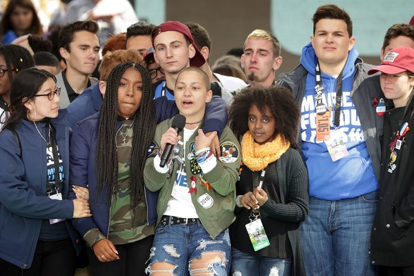
A group of people are standing together and one is holding a bottle.

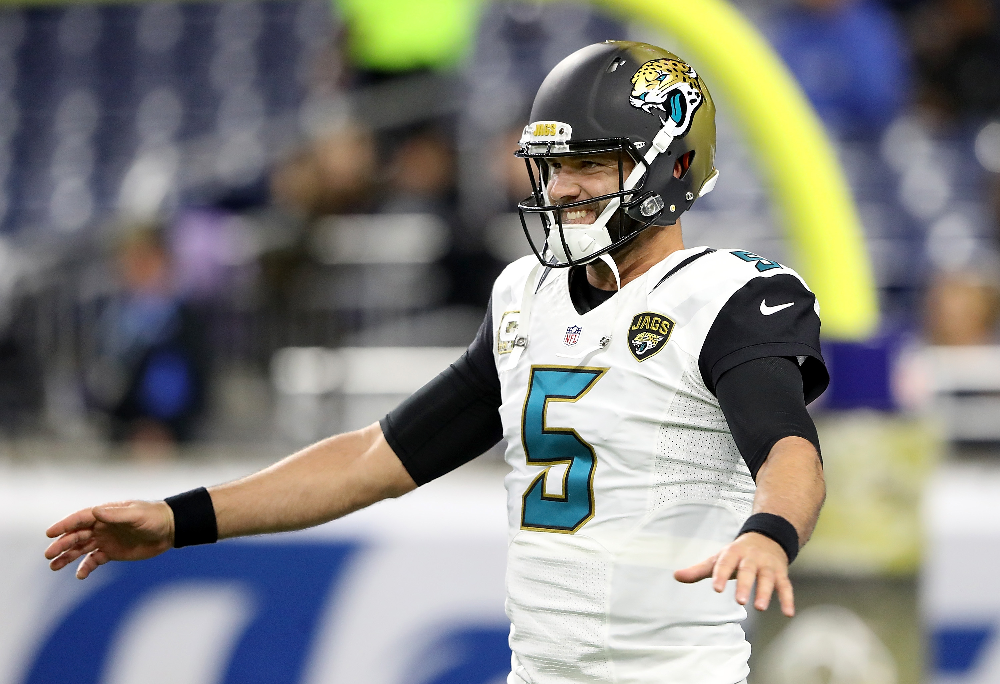
A football player in a sooners uniform with a football.

#### Somewhat Related to the Image

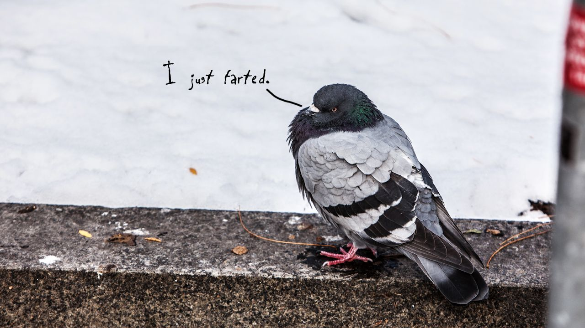
A bird is flying over the water.

A man in a black shirt and a man in a black shirt and a man in a black shirt and white cap.

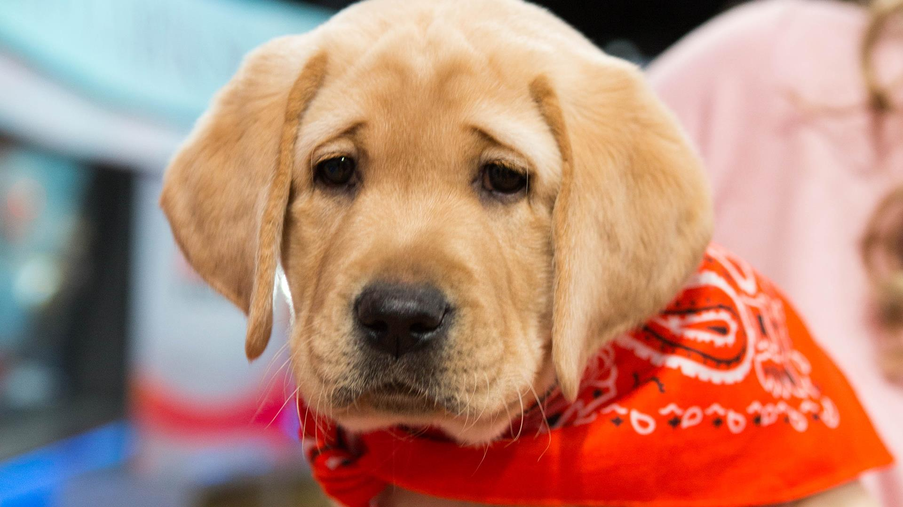
A dog is shaking off water.

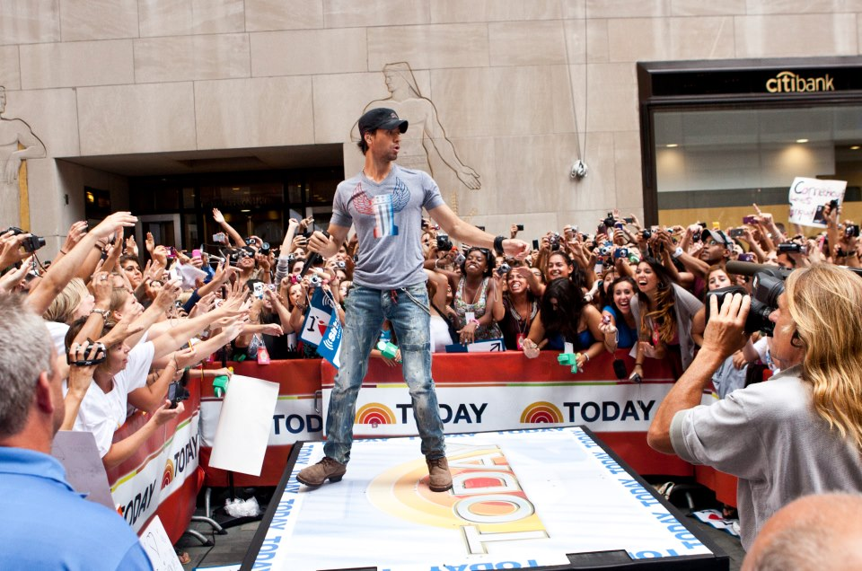
A group of people are dancing in a parade.

#### Unrelated to the Image

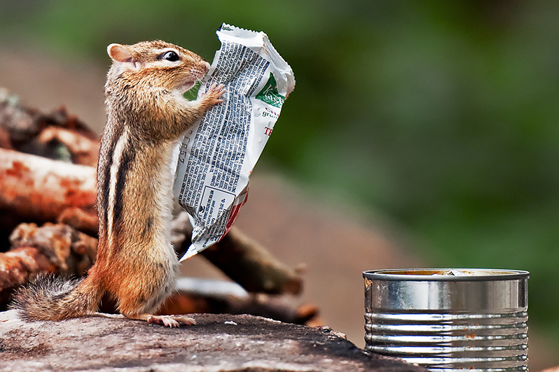
A dog is running through a grassy area.

A woman in a black shirt is standing in front of a large display of art.

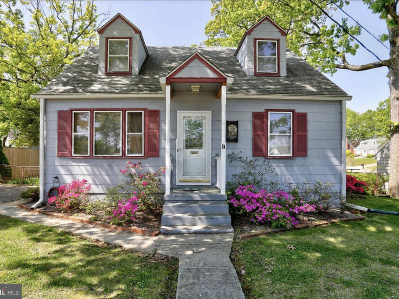
A man sits on a bench in front of a large building.

A dog is jumping on a couch with a bottle of milk.

A small dog is jumping on a bed with a green blanket and a pointy white toy.

### Inception V4 + NVIDIA GeForce GTX 960M

#### Describes without Errors

A group of young men are playing soccer on a field.

A baseball player in a white uniform is running with the ball.

#### Describes with Minor Errors

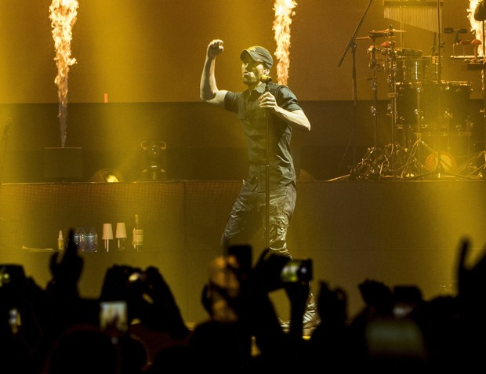
A man in a white shirt is dancing.

A group of people are standing in front of a building.

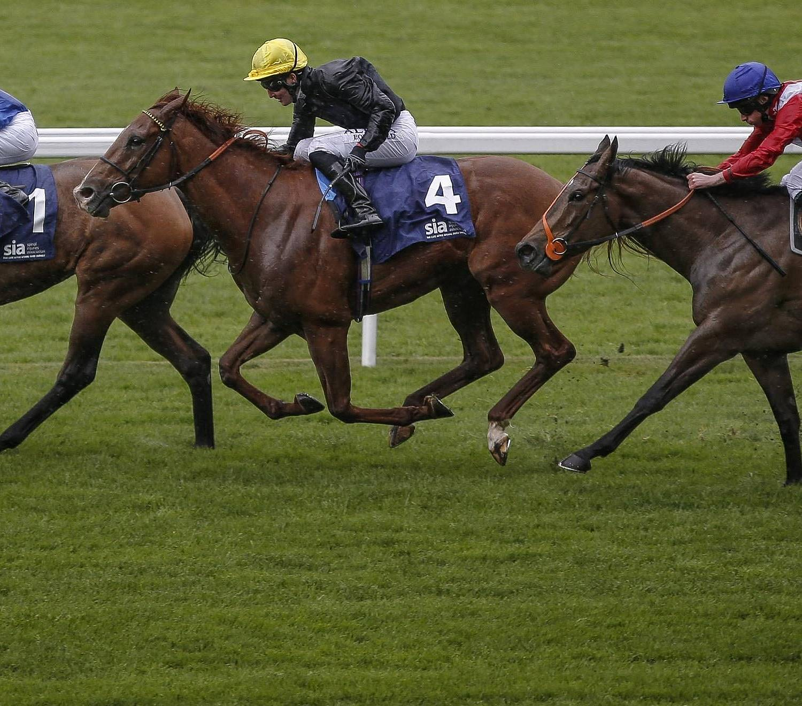
A horse jumps over a hurdle.

A man in a white shirt and a white shirt is running on a track.

#### Somewhat Related to the Image

A woman in a white shirt is sitting on a bench with a dog.

A man and a woman are sitting in front of a building.

A football player in a red jersey is running with the ball.

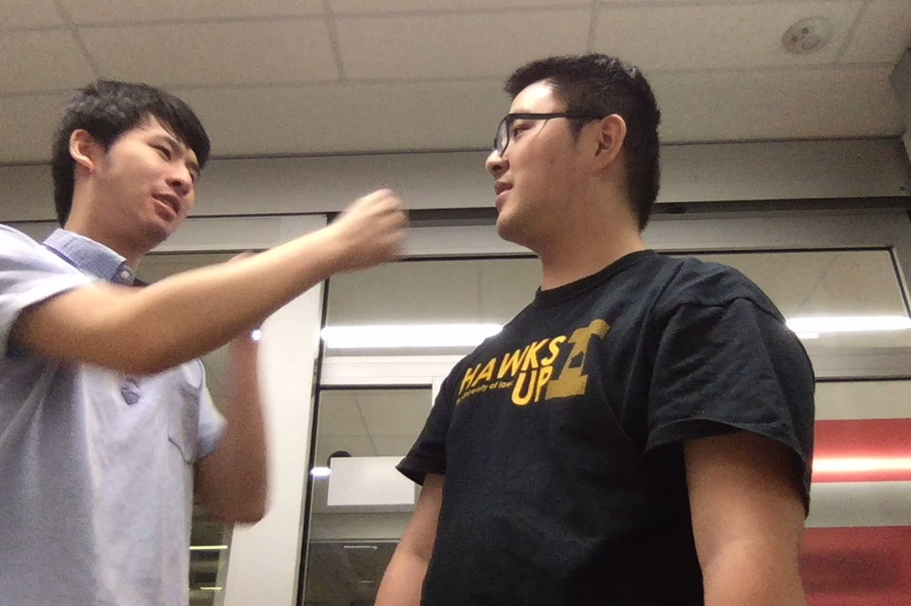
A man in a black shirt and a man in a black shirt and jeans standing in front of a building.

#### Unrelated to the Image

A white dog is running on a beach.

A man in a white shirt and jeans is running on a sidewalk.

A man in a red shirt and jeans is standing in front of a building.

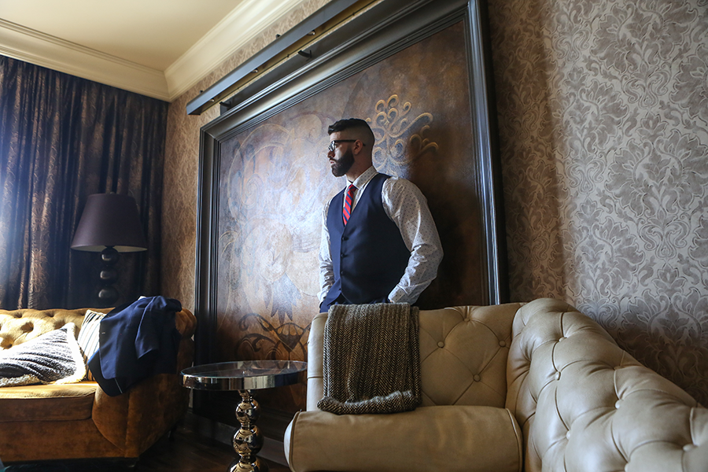
A man and a woman sit on a bench.

## Conclusion

We successfully designed and implemented an image captioning model. After training the model for about 50 epochs, it can predict a caption base on a randomly given image. 

We notice that our model has a better performance on images related to sports (such as football and baseball) and dogs and a worse performance on images related to other animals (such as cat and bird) or pure landscape. We guess this is beacuse the dataset `Flickr8k` contains more sports or dogs images and less other animals or landscape images. If we can switch to some other image datasets, such as `Flickr30k`, we should get a better result. Tiancheng

As we compare results of two models with different CNN models, we can see the results of inception-v3 model are better. That's not we expect. However, the inception-v3 is trained with 55 epochs while the inception-v4 is trained only with 28 epochs. It is not a fair comparison. Nevertheless, from the loss and accuracy charts, we can see the inception-v4 has larger reduce rate on loss and larger increase rate on accuracy. Therefore, we can expect that the model with inception v4 would perform better than the inception v3 if they are trained in the same environment. Yizhen

