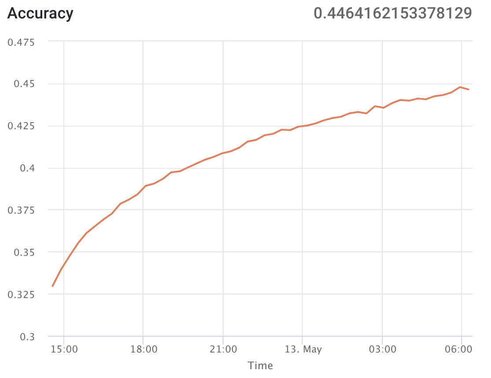
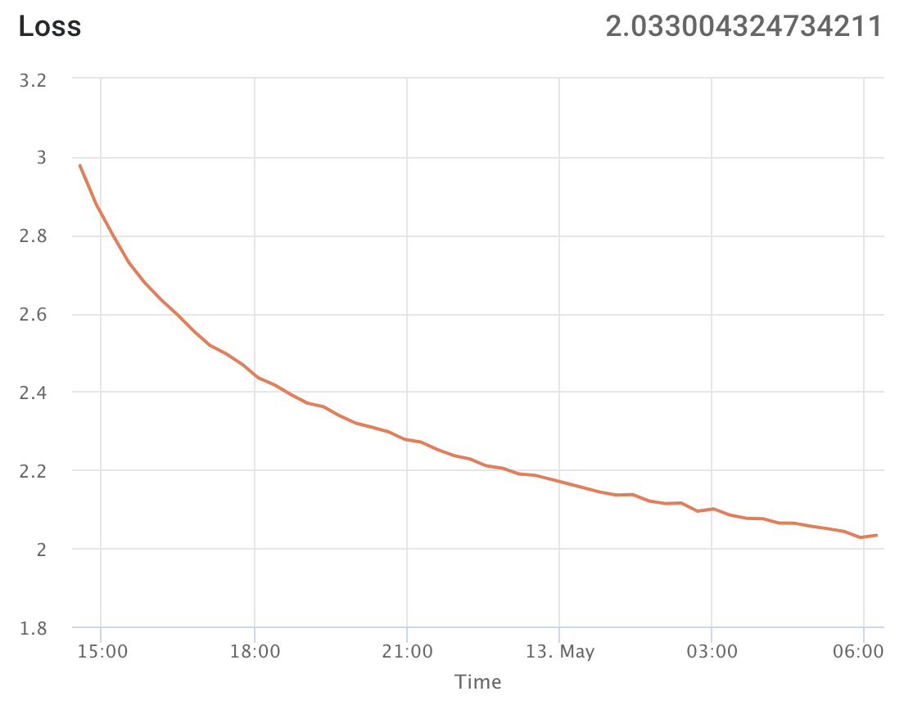

# Project Proposal

Click [here](../proposal/) to view our project proposal.

# Progress Report

Click [here](../report/) to view our progress report.

# Analyse
We analyzed the paper ["Deep Visual-Semantic Alignments for Generating Image Descriptions"](https://cs.stanford.edu/people/karpathy/cvpr2015.pdf) by Andrej Karpathya and Li Fei-Fei and the paper ["Show and Tell: Lessons learned from the 2015 MSCOCO Image Captioning Challenge"](https://arxiv.org/pdf/1609.06647.pdf) by Vinyals et al. from Google.

In Deep Visual-Semantic Alignments for Generating Image Descriptions, they use [VGG16](http://www.robots.ox.ac.uk/~vgg/research/very_deep/) as their CNN. Their image captioning model is VGG16 combined with 2 layers of LSTM RNN. In their code, the base implementation is using [Torch](http://torch.ch/) as their deep learning framework. They use Flickr8K / Flickr30K / COCO as their datasets. The basic model structure looks like [this](../assets/model_1.png). The last fully-connect softmax layer is removed, instead they use a dense layer mapping CNN output to the RNN input. An improvement can be made on their model by adding CNN output as initial state to every RNN hidden layer -- [An alternative model](../model_2.png).
In Show and Tell: Lessons learned from the 2015 MSCOCO Image Captioning Challenge, the researchers in Google find a alternative way to achieve the same purpose. They use the similar structure like Andrej Karpathya and Li Fei-Fei did. However, they use TensorFlow as deep learning framework. 
# Process
## Introduction

## Implementation

### preprocessing/generator.py

There are two things happen in this file.

The `generator` function reads the data of captions and get a list of all the images. After that, it call `Caption Preprocessor` and feed all the captions so that the `Caption Preprocessor` can build dictionary like structure to store all the words and their index. Then, it call `Image Preprocessor` to convert all the images to a `np.array` with the shape (8000, 299, 299, 3). 8000 is the number of images. 299 is the size of each image. And 3 means three colors (RGB). In the end, it return an `Image Sequence` instance.

The `ImgSequence` (`Image Sequence`) class gets all the data of images, and captions and provides an iterable function `__getitem__`. Every time when the `fit_generator` calls `__getitem__`, it will choose `n` (`n = batch_size`) images randomly and then choose one of their captions randomly (each image has at least five captions). After that, it will encode the captions to a `np.array` with the shape (35, 31, 8389). 35 is the batch size. 31 is the sentence length. And 8389 is the length of the words dictionary. The inputs and outputs have one word difference. So if the input is `<sos> A dog with a red Frisbee flying in the air`, the output should be `A dog with a red Frisbee flying in the air <eos>`. In the end, the function wrap all the batch data together and return them to the `fit_generator`.

### preprocessing/caption_processing.py 

`Caption Preprocessor` provides functions to convert all the image captions to dictionary like structure. We use a text tokenization utility class called `Tokenizer` from `Keras` to handle most of the tasks. First,  it reads all the captions provided by `generator` and warps them with the starting tag `<sos>` and ending tag `<eos>`. After that, it fits the captions to the `Tokenizer` and get the dictionary results. It also provides functions for `ImgSequence` to encode the captions.

## Training

### Inception V3 + NVIDIA Tesla K80

We use Inception V3 as the pretrained image recognition model in this training. We use a machine from [Floyd](https://www.floydhub.com/) with NVIDIA Tesla K80 to do the training. It takes about 18 hours to finish 55 epochs. 

#### Training Accuracy

The training accuracy you see here starts at the sixth epoch. We trained the first five epochs to verify our model and then continued to the sixth training.

#### Training Loss

### Inception V4 + NVIDIA GeForce GTX 960M

# Results

# Conclusion

